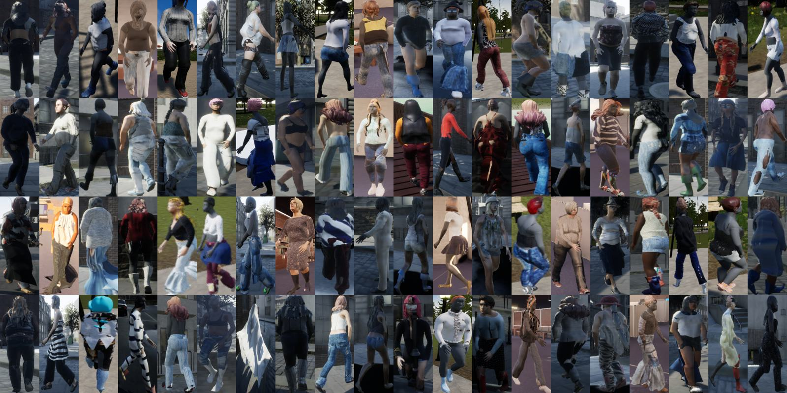

# CCUP：: A Controllable Synthetic Data Generation Pipeline for Pre-training Cloth-Changing Person Re-Identification Models

## Introduction

Cloth-changing person re-identification (CC-ReID), also known as Long-Term Person Re-Identification (LT-ReID) is a critical and challenging research topic in computer vision that has recently garnered significant attention. However, due to the high cost of constructing CC-ReID data, the existing data-driven models are hard to train efficiently on limited data, causing overfitting issue. To address this challenge, we propose a low-cost and efficient pipeline for generating controllable and high-quality synthetic data simulating the surveillance of real scenarios specific to the CC-ReID task. Particularly, we construct a new self-annotated CC-ReID dataset named Cloth-Changing Unreal Person (CCUP), containing 6,000 IDs, 1,179,976 images, 100 cameras, and 26.5 outfits per individual. Based on this large-scale dataset, we introduce an effective and scalable pretrain-finetune framework for enhancing the generalization capabilities of the traditional CC-ReID models. The extensive experiments demonstrate that two typical models namely TransReID and FIRe^2, when integrated into our framework, outperform other state-of-the-art models after pretraining on CCUP and finetuning on the benchmarks such as PRCC, VC-Clothes and NKUP.

## License

This dataset may be used for scientific research only and **not for commercial purposes**.

## Download

Our dataset is available at : [Baidu Netdisk](https://pan.baidu.com/s/1kSY7BBsEy52CPXEml5tiqg)(the code is: ak4v).
